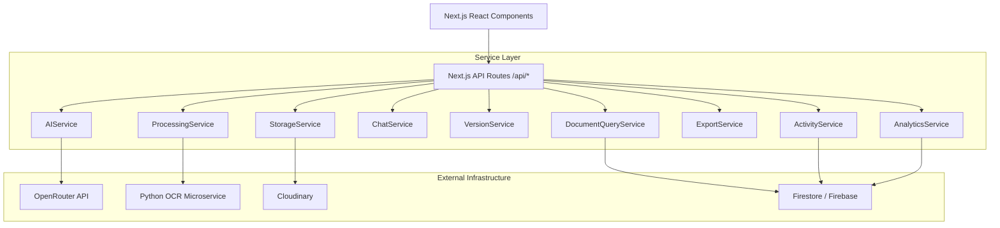

# DocAutomation - Architecture Overview

DocAutomation is designed with a strict **Service Layer Architecture** inside a Next.js (App Router) environment. 
This separates presentation from business logic and allows features to be built reliably.

## System Architecture

## The Service Layer
All significant business logic lives inside `src/lib/services/`.
- **AIService**: Handles prompt construction, LLM streaming, translations, and unstructured-to-structured JSON extraction.
- **ActivityService**: Non-blocking, best-effort logging layer for user and system activities.
- **AnalyticsService**: Aggregates document metadata and templates via Firestore `count()` aggregations without deeply fetching documents.
- **DocumentQueryService**: Encapsulates all document-fetching logic including cursor-based pagination and multi-field prefix search.
- **ExportService**: Stateless logic to transform Firestore document structure into JSON, CSV, and Excel buffers.
- **StorageService**: Handles binary file upload and streaming to Cloudinary.

## Key Design Principles
1. **Thin API Routes**: Controllers in `/api` only validate requests, invoke services, and handle `try/catch` wrapping.
2. **Read-Only Enhancements**: New features (Export, Analytics, Activity) were built as read-only extensions that do not risk breaking the core OCR/AI Pipeline.
3. **No Database Migrations**: Firestore is schemaless. The backend is designed to handle loosely structured document types without strict schema migrations.
4. **Resiliency**: Critical API steps fail gracefully (e.g., if OCR times out, the document is flagged but the system doesn't crash). Activity Logging is strictly decoupled from the main thread via `.catch()`.
